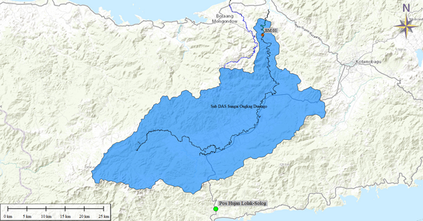

```{r setup, include=FALSE}
library(ggplot2)
library(readr)
library(knitr)
knitr::opts_chunk$set(echo = FALSE,message = FALSE,dpi = 300, fig.align="center")
#knitr::read_chunk('visualize-and-grouping-data.R')
```

```{r nama-lokasi-proyek}
# nama-nama unik pada proyek yang dibuat
subdas <- "DIT Malingkopoto"
jumlah_pos <- 1
jumlah_pos_text <- "satu"
Sta_1 <- "Stasiun Hujan Malingkapoto"
#Sta_2 <- "Stasiun Hujan Pintu Rime Gayo"
#Sta_3 <- "Stasiun Hujan Silih Nara"
```

# Sub DAS `r subdas`

Untuk dapat menghitung debit banjir dan debit andalan, diperlukan 2 (dua) inputan data utama. Input yang pertama adalah karakteristik dari sub DAS yang ditinjau seperti luasan, panjang sungai, dan kemiringan sungai. Kemudian input kedua yang diperlukan adalah curah hujan rencana.

Untuk data karakteristik sub DAS diperoleh dari deliniasi peta rupa bumi Indonesia (RBI) dan peta Wilayah Sungai dari Permen PUPR No. 4 Tahun 2015 Tentang Kriteria dan Pembagian Wilayah Sungai. Hasil deliniasi untuk lokasi yang ditinjau ditampilkan pada Gambar \@ref(fig:subdas-all2) di bawah ini.

(ref:subdas) Lokasi ***Sub DAS*** `r subdas`

```{r subdas-all2, fig.cap='(ref:subdas)', out.width='60%', fig.asp=.75, fig.align='center'}

```

# Data Hujan

Data hujan yang digunakan bersumber dari BMKG. Di sekitar area sub DAS terdapat `r jumlah_pos` (`r jumlah_pos_text`) stasiun hujan yang terdekat. Yaitu `r Sta_1`. Berikut ditampilkan posisi stasiun hujan terhadap sub DAS (Gambar \@ref(fig:lokasi-pos-hujan)) serta tabel data hujan pada masing-masing stasiun tersebut.

(ref:pos-hujan) Lokasi Pos Hujan Terhadap Sub DAS `r subdas`

```{r lokasi-pos-hujan, fig.cap='(ref:pos-hujan)', out.width='60%', fig.asp=.75, fig.align='center'}

```

# Pemeriksaan Data Hujan

## Pemeriksaan Outlier

# Debit Banjir

## Bagan Alir Perhitungan Debit Banjir

## Analisa Frekuensi

### Distribusi Normal

### Distribusi Log Normal

### Distribusi Log Pearson III

### Distribusi Gumbel

## Uji Pemilihan Distribusi Frekuensi

## Distribusi Hujan

## Koefisien Pengaliran dan Hujan Efektif

## Perhitungan Debit Banjir

### Perhitungan Dengan Metode Hidrograf Satuan Sintetis (HSS)

### Pemilihan Metode Debit Banjir

# Debit Andalan

## Evapotranspirasi

## Model F.J Mock

### Parameter Model FJ. Mock

### Hasil Perhitungan Model FJ. Mock
